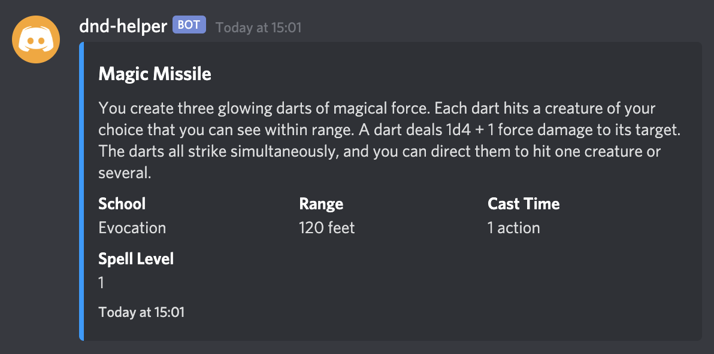

# D&D 5e Discord Helper

> **Pre-release - tested running locally on Mac only so far**

A Discord bot that aims to augment or improve your online D&D 5e sessions. Currently, the helper bot has two commands to help in that respect:

- `!play {themeName}`
- `!spell {spellSlug}` - provided by the [Open5e](https://open5e.com/) API.

The intention is to add more feature sets and improve user experience over time. If you find any issues

## Set up

Clone the repo and run `npm install`. You also need to add an `.env` file to the root of the project directory and populate it with your Discord bot access token, like so:

```env
ACCESS_TOKEN=yourAccessTokenHere
```

You should then be able to run the bot locally by running `npm run start`.

### Loading your playlist

The playlist is a JSON file that contains the YouTube videos you want audio to be loaded from and played in the voice channel. The bot uses keys as the command identifier; each key contains an array value of strings that the bot then parses at random to select a track.

Example:

```json
{
    "town": ["url-for-town-example-1", "url-for-town-example-2"],
    "battle": ["battle-example-url"]
}
```

By default, when you run `npm run script`, the app will take the `playlist.json` file from `dist/public/playlist.json`. You can override this by passing your own playlist in the command line, like so:

```shell
npm run build -- --playlist=path/to/your/playlist.json
```

You can then tell the bot to play music with `!play` followed by the key. The bot will then choose one of the tracks within that key at random. Of course, if there is only one track, then the bot will play just that (if you wanted to have more control over what track is played).

```
!play town
```

### Spell Dictionary

The bot can also provide spell details, provided via [Open5e](https://open5e.com/).

To fetch details of a spell, you should provide the slugified format of the spell name to the bot, like so:

```
!spell magic-missile
!spell fireball
!spell arcanists-magic-aura
```


